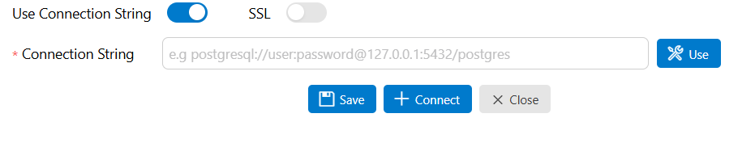

# Executer la base de données dans Docker:

- verifier docker-compose.yml
- vérifier init-content.sql

```cmd
docker compose up -d
```

# Ouvrir une bdd depuis une source externe :



## Railway:

se connecter via l'URL:
DATABASE_PUBLIC_URL
PGHOST
PGPASSWORD
PGPORT
PGUSER
POSTGRES_DB

une fois connecté, creer une table et copie le script sql dans fichier create-table-template.sql

## Executé le serveur: 

```cmd
npm run start


```